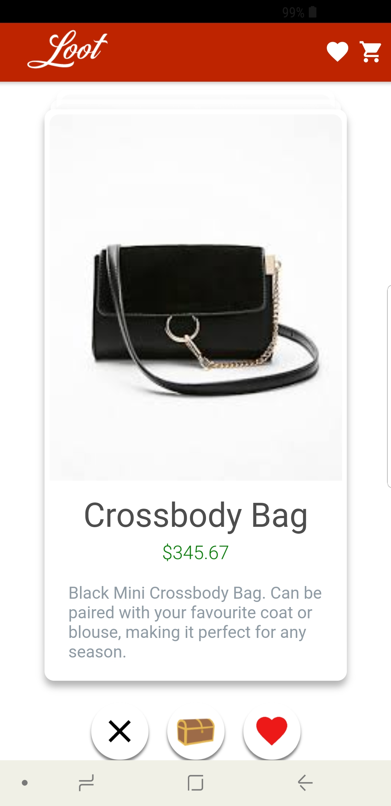
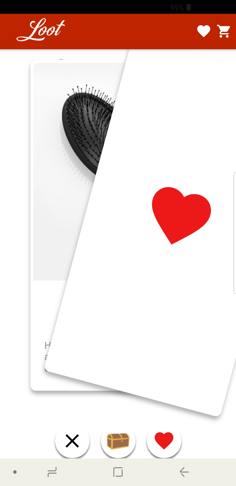
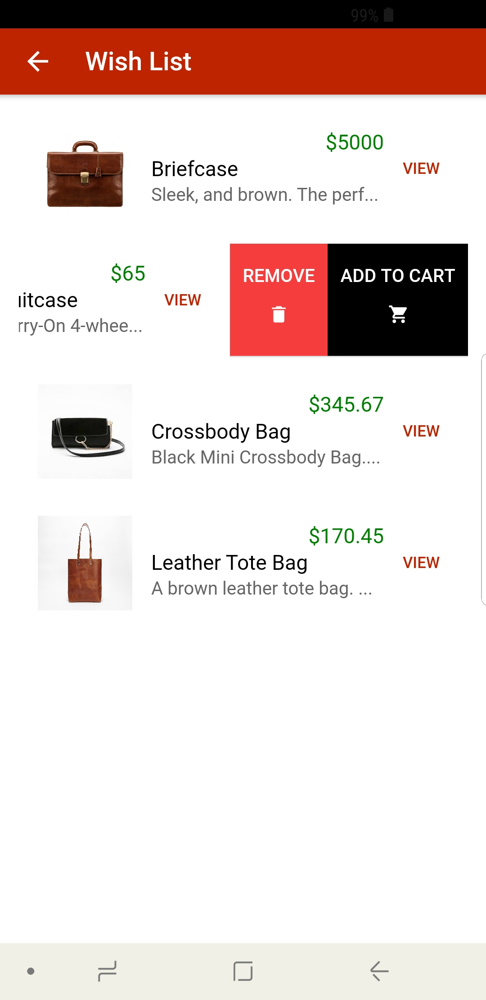
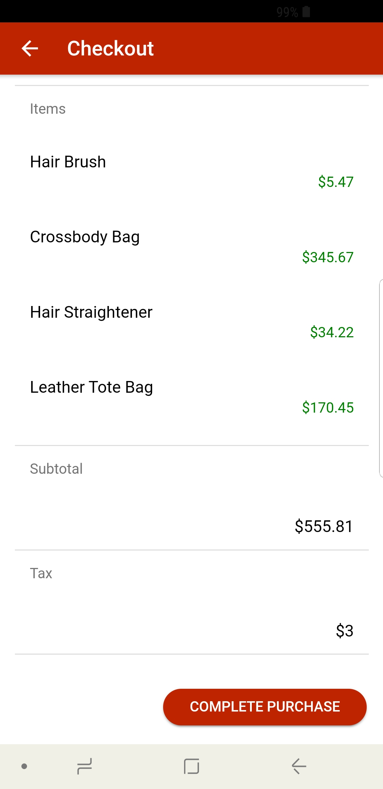

# Loot

Loot was born out numerous iterations of an idea that started out as an app for arranging item exchanges and transactions among college students. After realizing there was no need to limit the user base in this way, we began thinking about ways we could design an e-commerce experience that would make it easy to use and promote spontaneous purchases.

Eventually we came up for the idea of an app that shows users products in a continuous stack of cards which would allow them to swipe in one of three directions to indicate their feeling about the product. If they swipe left on the product, that indicates they do not like it. Swiping right indicates they do like the product and want to add it to a "wish list" they can go back to later. Swiping up on a product adds it to their shopping cart, which then allows them to easily purchase it, as well as anything else added to the cart, on the next screen. This system of shopping allows for a continuous stream of user information and preferences to be collected, analyzed, and used to refine which products to show to which users.

This project won us the **Best UX/UI Design** and **Best Use of Moltin API** awards at this hackathon. We were then able to meet with the Moltin staff at their office in downtown Boston to describe our app idea to them. There are currently no plans to continue developing this project, but the experience was extremely valuable.

Developed using [Ionic Framework](https://ionicframework.com/) with [Firebase](https://firebase.google.com/) and [Moltin API](https://www.moltin.com/) on the backend

